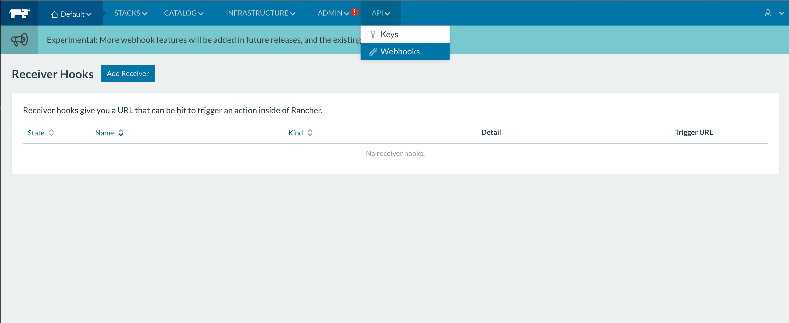
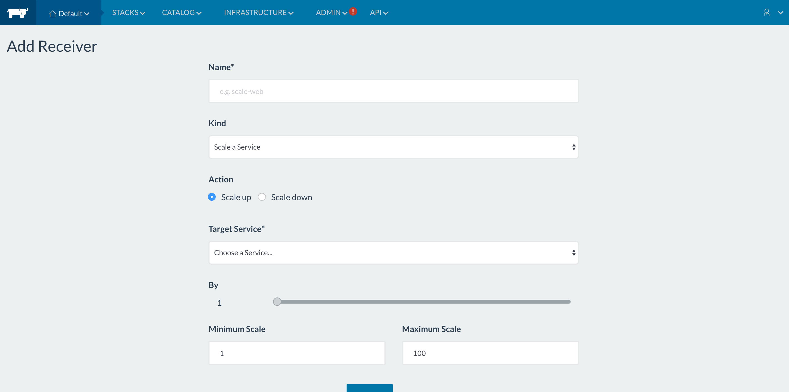
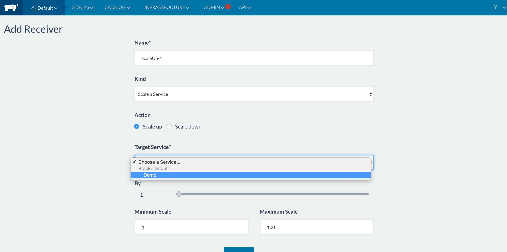
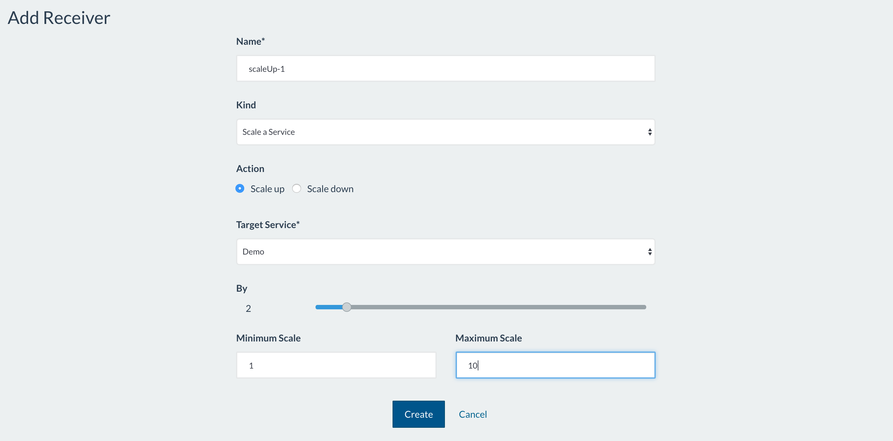

# Webhooks

## Webhook-service
Rancher has added a new feature in 1.4 for webhooks. Webhooks are a way of getting real time data of your application, and executing pre-defined actions for the application. All this is done without having to query the application periodically. We have implemented webhooks with our new microservice, called webhook-service. Webhook-service has drivers defined for actions to be taken in case a particular event occurs. I will explain this using our current driver, scaleService. The driver scaleService is for scaling up and down of a service by a given number of containers.

### Creating a webhook
Navigate to **API -> Webhooks** in the UI. This is where all the webhooks you create for the selected environment will be listed under `Receiver Hooks`  

Click on `Add Receiver` to create the webhook. You will see all these fields to be entered for creating the webhook.  

On this page, the fields to be entered are as follows 
- **Name**: Every webhook should be given a unique name so it can be easily identifed.
- **Kind**: The `Kind` dropdown gives a list of all drivers available in webhook-service. Select a driver from this list. (Only `Scale a Service` is available for 1.4)
- **Action**: This field lets specify the action specific to the driver. For the scaleService driver, the only two actions are `up`(increase the number of containers) and `down`(decrease the number of containers).
- The fields after this are specific to the scaleService driver
 - **Target Service**: Select the service to be scaled from this dropdown  

 - **By**: The field `By` asks the user to enter the amount by which the selected service should be scaled.
 - **Minimum Scale** and **Maximum Scale**: Enter the minimum and maximum number of containers your service can be allowed to have. Scaling the service beyond these values using webhooks won't be allowed.

Click on `Create` once all fields are entered  

The created webhook will now be listed on the webhooks page. The `Trigger URL` is what should be used for the actual execution of scale up and scale down. Next to it, there's also a field for options, that options such as include deleting and cloning a webhook  

### Using the webhook
The `Trigger URL` will execute the action for the driver. To use the trigger URL, you will need to do a POST to the specific URL. There is no authentication or body needed to POST to the URL. This URL consists of an API endpoint and a token. The token contains all the information of the created webhook, such as selected driver, service, action(up/down), amount that the service should be scaled by and so on. The API endpoint uses this token to make cattle API calls in order to complete the action provided in the created webhook.

### Using webhook-service for autoscaling
The scaleService driver from webhook-service can be used for autoscaling of a service based on container metrics. For this an external monitoring service needs to be used. Once you create a service, add a webhook for it using the above steps. Then copy the Trigger URL and use it in the monitoring service, in a way that a `POST` request is sent to this trigger url when a particular metric crosses its threshold. Monitoring services such as Prometheus have a field called `webhook_configs` to specify such urls that need a `POST` request sent to them. Once you have configured this, scaling of the service will be handled by the webhook-service.

## Upcoming drivers and contributions
As mentioned above, we plan on adding more drivers to webhook-service. For future releases, we are working on adding drivers for scaling up/down hosts and redeploying services based on Dockerhub webhooks. We would love to get contributions for new drivers as well. You can refer to these [steps](https://github.com/mrajashree/Webhook-blog/blob/master/Steps.md) for adding new drivers and submit pull requests to our [webhook-service](https://github.com/rancher/webhook-service) repository.
